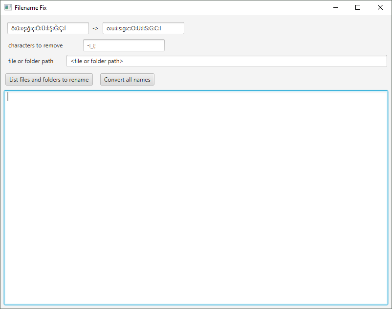
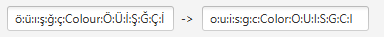

# FilenameFix
Renames the files under the specified path to get rid of unwanted characters.

## Warning
Folder rename functionality is not tested and probably buggy.

## Example usage

Textboxes at the first row are for replacing strings with other strings. ":" character is used as seperator since it is not allowed in the filenames. Characters to remove are simply for removing unwanted characters.

Multiple characters can be used between seperator characters for example.

means that all occurences of colour will ve replaced with color. As a result if you have a file with name "SourceColours.png", it will be renamed to "SourceColors.png".

## Buttons

This button does not make any rename operation, so it is safe to use it before actual rename operation to see which files and folders will be renamed.

This button exeutes necessary rename operations and reports failed operations and their count, if any rename operation fails for any reason.
